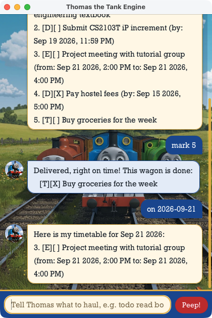

# Thomas User Guide



**Thomas** is a chatbot that keeps your task list for you. Type a command, and
Thomas the Tank Engine couples your tasks onto his train, tells you what he did,
and remembers everything between runs. He is quick to use once you know the
handful of commands below.

- [Quick start](#quick-start)
- [Features](#features)
  - [Adding a task: `todo`, `deadline`, `event`](#adding-a-task-todo-deadline-event)
  - [Listing every task: `list`](#listing-every-task-list)
  - [Marking a task done: `mark` and `unmark`](#marking-a-task-done-mark-and-unmark)
  - [Deleting a task: `delete`](#deleting-a-task-delete)
  - [Finding tasks by keyword: `find`](#finding-tasks-by-keyword-find)
  - [Seeing what falls on a day: `on`](#seeing-what-falls-on-a-day-on)
  - [Undoing a change: `undo`](#undoing-a-change-undo)
  - [Exiting: `bye`](#exiting-bye)
  - [Saving your tasks](#saving-your-tasks)
- [FAQ](#faq)
- [Command summary](#command-summary)

## Quick start

1. Make sure you have **JDK 25** installed.
2. Download the latest `thomas.jar` from the releases page.
3. Put it in the folder you want Thomas to keep your tasks in.
4. Double-click the file, or run `java -jar thomas.jar` from that folder.
   A window opens and Thomas greets you.
5. Type a command in the box at the bottom and press Enter. Try these:

   - `todo borrow book` — adds a task to the list
   - `list` — shows every task
   - `mark 1` — marks the first task as done
   - `bye` — closes the window

Read on for what each command does.

## Features

> **How to read the command formats**
>
> - Words in `UPPER_CASE` are what you fill in: `todo DESCRIPTION` could be
>   `todo borrow book`.
> - Dates are typed as `yyyy-mm-dd HHmm` on the 24-hour clock, for example
>   `2019-12-02 1800` for 6 pm on 2 December 2019. Thomas shows them back as
>   `Dec 02 2019, 6:00 PM`.
> - Task numbers are the ones `list` shows, counting from 1.
> - Extra spaces around a command or its parts are ignored.

### Adding a task: `todo`, `deadline`, `event`

There are three kinds of task. Each is added with its own command:

| Kind | What it is | Format |
|------|------------|--------|
| Todo | Something to do, with no date | `todo DESCRIPTION` |
| Deadline | Something due by a time | `deadline DESCRIPTION /by DATE` |
| Event | Something that starts and ends at a time | `event DESCRIPTION /from DATE /to DATE` |

Examples:

- `todo borrow book`
- `deadline return book /by 2019-12-02 1800`
- `event project meeting /from 2019-12-02 1400 /to 2019-12-04 1600`

Thomas echoes the new task with its tag (`[T]`, `[D]` or `[E]`) and the size of
the list:

```
Coupled up! This wagon is on the train now:
   [D][ ] return book (by: Dec 02 2019, 6:00 PM)
That's 2 wagon(s) behind me now.
```

A few rules to know:

- An event must end at or after it starts.
- Thomas refuses a task that is already on the list, and tells you its number.
- A description cannot contain ` | ` (a pipe with a space on each side), since
  that is how the save file is laid out. `A|B` without the spaces is fine.

### Listing every task: `list`

Shows every task, numbered. The number is what `mark`, `unmark` and `delete`
take.

Format: `list`

```
Here is every wagon on my train:
1. [T][ ] borrow book
2. [D][X] return book (by: Dec 02 2019, 6:00 PM)
3. [E][ ] project meeting (from: Dec 02 2019, 2:00 PM to: Dec 04 2019, 4:00 PM)
```

`[X]` means the task is done; `[ ]` means it is not.

### Marking a task done: `mark` and `unmark`

`mark` ticks a task off; `unmark` takes the tick back.

Format: `mark TASK_NUMBER` or `unmark TASK_NUMBER`

Example: `mark 2`

```
Delivered, right on time! This wagon is done:
   [D][X] return book (by: Dec 02 2019, 6:00 PM)
```

Marking a task that is already done leaves it done; the same goes for
unmarking one that is not.

### Deleting a task: `delete`

Removes a task from the list. The tasks after it move up one number.

Format: `delete TASK_NUMBER`

Example: `delete 3`

```
Uncoupled! I've left this wagon in the siding:
   [E][ ] project meeting (from: Dec 02 2019, 2:00 PM to: Dec 04 2019, 4:00 PM)
That's 2 wagon(s) behind me now.
```

Deleted by mistake? See [`undo`](#undoing-a-change-undo).

### Finding tasks by keyword: `find`

Shows the tasks whose description contains a word or phrase.

Format: `find KEYWORD`

Example: `find book`

```
I searched the yard and found these wagons:
1. [T][ ] borrow book
2. [D][X] return book (by: Dec 02 2019, 6:00 PM)
```

- The search is case sensitive: `find Book` does not match `borrow book`.
- The whole of what you type is the keyword, spaces included, so
  `find return book` looks for that phrase, not for either word.
- Only the description is searched, not the dates.
- Each match keeps its number from `list`, so you can `mark` or `delete` it
  straight from the results.

### Seeing what falls on a day: `on`

Shows the deadlines due on a day and the events happening on it. An event
counts on every day from its start to its end. Todos have no date, so they
never appear.

Format: `on DATE` — the date only, as `yyyy-mm-dd`, with no time

Example: `on 2019-12-02`

```
Here is my timetable for Dec 02 2019:
2. [D][X] return book (by: Dec 02 2019, 6:00 PM)
3. [E][ ] project meeting (from: Dec 02 2019, 2:00 PM to: Dec 04 2019, 4:00 PM)
```

As with `find`, the numbers are the ones `list` shows.

### Undoing a change: `undo`

Reverses the most recent add, delete, mark or unmark. Use it again to go back
one more step, most recent first.

Format: `undo`

```
Reversing! I've backed out of 'delete 3'.
That's 3 wagon(s) behind me now.
```

- Commands that change nothing (`list`, `find`, `on`) and commands Thomas
  rejected are skipped over, so `undo` always reverses the last real change.
- The undo history is kept only while Thomas is running. After a restart there
  is nothing to undo.

### Exiting: `bye`

Closes Thomas.

Format: `bye`

### Saving your tasks

Thomas saves the list to `data/tasklist.txt`, next to `thomas.jar`, after
every command that changes it. There is nothing to do by hand, and your tasks
are there when you next start Thomas, done ticks and all.

The file is plain text, but editing it directly is not recommended: Thomas
skips any line it cannot read and tells you so when it starts.

## FAQ

**Q: What does Thomas say when I get a command wrong?**
A: He tells you what was missing, for example
`When is it due? A deadline needs a /by before I can pull it.` Nothing changes
on the list, so just retype the command.

**Q: Can I use my tasks on another computer?**
A: Yes. Copy the `data` folder to sit beside `thomas.jar` on the other
computer.

**Q: Why does Thomas reject `2019-12-02 6pm`?**
A: Dates need the 24-hour time in four digits: `2019-12-02 1800`. The `on`
command is the exception, and takes only the date.

## Command summary

| Action | Format | Example |
|--------|--------|---------|
| Add todo | `todo DESCRIPTION` | `todo borrow book` |
| Add deadline | `deadline DESCRIPTION /by DATE` | `deadline return book /by 2019-12-02 1800` |
| Add event | `event DESCRIPTION /from DATE /to DATE` | `event project meeting /from 2019-12-02 1400 /to 2019-12-04 1600` |
| List | `list` | `list` |
| Mark done | `mark TASK_NUMBER` | `mark 2` |
| Mark not done | `unmark TASK_NUMBER` | `unmark 2` |
| Delete | `delete TASK_NUMBER` | `delete 3` |
| Find | `find KEYWORD` | `find book` |
| Tasks on a day | `on yyyy-mm-dd` | `on 2019-12-02` |
| Undo | `undo` | `undo` |
| Exit | `bye` | `bye` |
